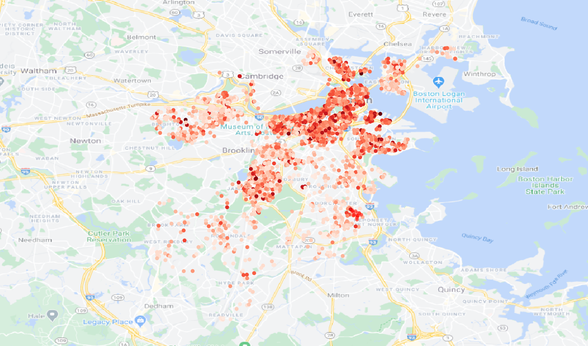

# Boston airbnb analysis
This project includes analysis of Boston airbnb data ([source](http://insideairbnb.com/get-the-data.html)) compiled on September 7, 2016. The data utilizes public information compiled from the Airbnb web-site including the availabiity calendar for 365 days in the future, and the reviews for each listing. Data is verified, cleansed, analyzed and aggregated. 

## Exploratory data analysis (EDA.ipynb)
Here we look at the data from files:
* listings.csv - detailed Listings data for Boston
* calendar.csv - detailed Calendar Data for listings in Boston
* reviews.csv  - detailed Review Data for listings in Boston

We consider common properties of each dataset. Look at the cleanliness and usefullness of columns given in listings table, as well as collect additional columns using calendar and reviews. The general result of the EDA pipeline is the preprocessed listings dataset.

## Price reccomending model (Price_recommender.ipynb)
Using the data we can answer the question: what is a usual price for the listing with the certain properties. Here we do not include reviews, response rates and availability factors, because of the following:
1. As we saw in EDA availability is not correlated with the price
2. Response rate is the information which you never have for the new listing
3. We don't have reviews for a new listing

The features which we use in the model are supposed to be catched at the moment of creation of a new listing. Thus, we can run the algorythm as a price recommender at the step, when the host shoul to set one. 