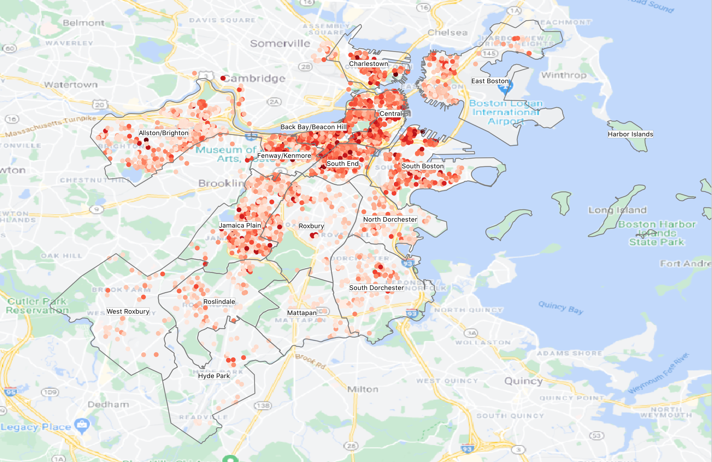

# Boston airbnb analysis
This project is an example of how you can perform a quick analysis of opensource airbnb data ([source](http://insideairbnb.com/get-the-data.html)). We demonstrate the EDA and modelling pipelines with Boston airbnb data compiled on September 7, 2016, but you can easily reuse the pipelines for many other cities and periods. The data utilizes public information compiled from the Airbnb web-site including the availabiity calendar for 365 days in the future, and the reviews for each listing. Data is verified, cleansed, analyzed and aggregated. 



## Project code structure 
### Exploratory data analysis (EDA.ipynb)
Here we look at the data from files:
* listings.csv - detailed Listings data for Boston
* calendar.csv - detailed Calendar Data for listings in Boston
* reviews.csv  - detailed Review Data for listings in Boston

We consider common properties of each dataset. Look at the cleanliness and usefullness of columns given in listings table, as well as collect additional columns using calendar and reviews. The result of the EDA pipeline is the basic overview of the provided data, including chats with price distributions, seasonality analysis, etc. In the end of the pipeline the preprocessed listings dataset is generated.

### Price reccomending model (Price_recommender.ipynb)
Using the data we can answer the question: what is a usual price for the listing with the certain properties? Here we do not include reviews, response rates and availability factors, because of the following:
1. As we saw in EDA availability is not correlated with the price
2. Response rate is the information which you never have for the new listing
3. We don't have reviews for a new listing

The features which we use in the model are supposed to be catched at the moment of creation of a new listing. Thus, we can run the algorythm as a price recommender at the step, when the host should set one.

## Results discussion

You are welcome to read the [Medium post](https://daria-satco.medium.com/how-much-you-should-ask-for-rent-3-steps-to-build-a-price-model-with-airbnb-data-for-boston-ebbf218c075e) with detailed presentation of the results from both pipelines.

## Requirements
```bash
nltk==3.5
numpy==1.19.1
pandas==1.1.0
python_dateutil==2.8.1
```